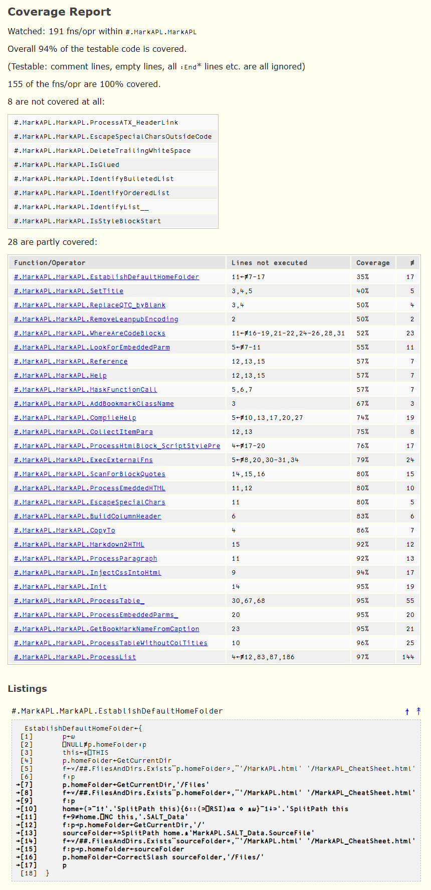

# The class `CodeCoverage`

## Overview

This class provides methods to watch certain parts of the workspace for being executed, probably as part of running
a test framework like [`Tester2`](https://github.com/aplteam/Tester2 "Link to Tester2 on GitHub"), although checking
on code coverage by just running an application can also be useful, especially for legacy code.

**Note:** `CodeCoverage` releases are published as [Tatin](https://tatin.dev "Link to the principal Tatin Registry") packages, see there.

## Getting started

The following gives an example, assuming that there is an application in `#.Foo` we are interested in:

```
      C←⎕NEW #.CodeCoverage (,⊂'#.Foo')
      C.ignore←'#.Foo.TestCases,#.Foo.Samples'
      C.filename←'./Foo-Coverage'
      C.Start ⍬
      #.Foo.Run ⍬
      C.Stop ⍬
      C.Finalise ⍬
      ⎕←#.CodeCoverage.ProcessDataAndCreateReport  C.filename
./Foo-Coverage.html      
      C.Start ⍬
      #.Foo.Run ⍬
      C.Stop ⍬
      C.Finalise ⍬
      ⎕←1 #.CodeCoverage.ProcessDataAndCreateReport C.filename      
./Foo-Coverage.html      
```

Notes

* On the second call to `#.CodeCoverage.ProcessDataAndCreateReport` a left argument of `1` was provided. This tells the function to add the bodies (canonical representations) of all functions and operators to the report that carry unexecuted lines. The unexecuted lines are highlighted (bold) and carry a right-pointing arrow to their left.

* The component file has 12 components because the application has been executed twice: The first 10 componenets are reserved for internal use, while the collected data of the two test runs is stored in the components 11 and 12, while the aggregated data is stored in component number 10 once the data has been aggregated by calling the `Finalise` method.

A real-world example taken from two runs of the test suite of the [`FilesAndDirs`](https://github.com/aplteam/FilesAndDirs "Link to FilesAndDirs  on GitHub") package looks like this:



Lines that are empty or contain nothing but a comment line, or contain only an element of a control structure such as `:Else` or any flavour of `:End` are not counted as executable lines.

The test suite was run twice, once on Windows and once on Linux. This is important because in a considerable number of cases `FilesAndDirs`  will execute different lines of code depending on the operating system.

The fact that there are four functions that are not covered at all will be of interest in any case:

  * If the report was generated by running a test suite, this means that these four functions are not covered at all.
  
  * If the report was generated by running the code using the application then it may be a good idea to check that those functions are not obsolete.
  
Ideally test cases should cover 100% of the code, but this may not be feasible. However, a code coverage of less than 50% seems to be unacceptable for functions that have a significant number of "executable" lines.


## More Details

### Limitations

* Nested scripts (Classes within classes, namespaces within namespaces, or a mixture of them) are not supported: the inner objects are simply ignored.

* At the time of writing Dyalog provides an `⌶` for retrieving the code of functions and operators, including private functions, from scripts, but it does not provide any help for analyzing a script to extract the names of all such functions and operators, so `CodeCoverage` does the analyzing itself.

  For this to work, `CodeCoverage` needs the code to be properly formatted. For example, to distinguish any `∇`  used for recursive calls in a dfn from a `∇` used as opening or closing tag for a traditional function, the number of leading spaces rules.

* Dfns, named or unnamed, that are defined locally within a dfn (or dop) are not recognized as such but only as part of the outer function.

* Named dfns defined locally within a traditional function (or operator) are completely ignored. The lines they occupy in a traditional function or a traditional operator are therefore erroneously reported as not covered. 

  The reason for this is that unfortunately `⎕PROFILE` does not provide the necessary information.

* This statement:

  ```
  :If a≡1 ⋄ MyFns 1 ⋄ MyOtherFns 2 ⋄ :EndIf
  ```

  will be reported as "covered" when the interpreter reaches this line, although clearly only one of the two function calls will be executed.

  Again this is a `⎕PROFILE` limitation that cannot be overcome.

  There are already a number of good reasons not to use `⋄`, and this is just another one.

### Running multiple test suites

It is possible to run the test suite more than once (e.g. on different platforms), or to run two test suites that share code (e.g. Client and Server part of an application) and have `CodeCoverage` aggregate all the coverage data into a single component file before generating a report.

After running the last test suite you can call the shared method `CodeCoverage.AggregateCoverageDataAndCreateReport` and pass the name of the component file containing all the  coverage data. The function will then aggregate the data, massage it and then create an HTML file with the final report.

`CodeCoverage` provides three shared methods for aggregation and reporting:

* `ProcessData` to aggregate and massage the data
* `CreateReport` to create a report based on the processed data
* `ProcessDataAndCreateReport` performs both steps in one go

#### The `verbose` option

`verbose`, the optional left argument of both `CreateReport` and `ProcessDataAndCreateReport`, defaults to 0. This means that the body of any function or operator that is only partially covered will not be listed in the report, only the fully qualified names and information about which lines were not executed, the coverage percentage and the total number of lines.

Usually this makes sense when you generate the first coverage report as you will often have quite a few functions that are not yet covered by the tests, and you will probably add more tests to cover some of them, or exclude those that you have good reasons not to be interested in; see the next topic for more on this.

Others may be so trivial that there is no point in covering them, so you may want to ignore them as well.

After you have done this, it is advisable to run the tests again with the coverage option enabled, but this time you generate the report with `verbose←1` because now it makes sense to look at the  details.

#### The `ignore` property

This is a text vector that is empty by default. You can add fully qualified comma-separated names of functions and operators that you want to be ignored when reporting on code coverage.

Note that `ignore` is an instance property.

