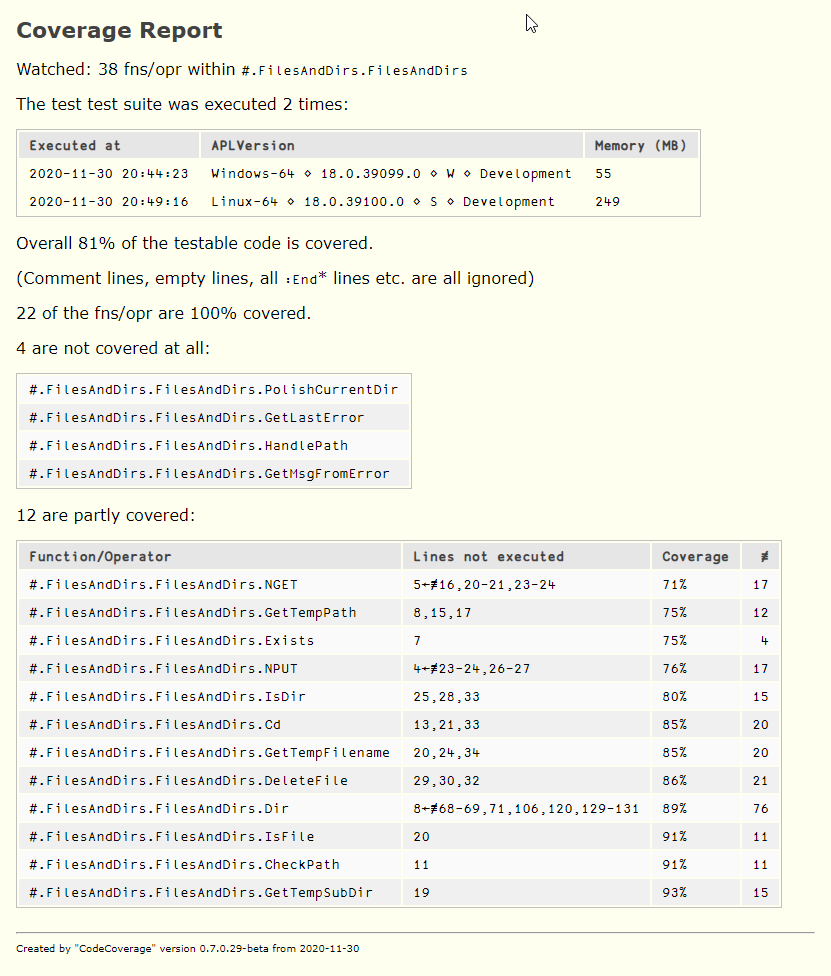

# The class `CodeCoverage`

This class offers methods to watch certain parts of the workspace for being executed, probably as part of executing
a test framework like [https://github.com/aplteam/Tester2](`Tester2` "Link to Tester2 on GitHub"), although checking
on code coverage by just running an application can make sense as well, in particular with legacy code.

The following gives an example, assuming that there is an application in `#.Foo` we are interested in:

```
      C←⎕NEW #.CodeCoverage (,⊂'#.Foo')
            C.ignore←'#.Foo.TestCases,#.Foo.Samples'
      C.filename←'./Foo-Coverage'
      C.Start ⍬
      #.Foo.Run ⍬
      C.Stop ⍬
      C.Finalyze ⍬
      #.CodeCoverage.ProcessDataAndCreateReport  C.filename
./Foo-Coverage.html      
      C.Start ⍬
      #.Foo.Run ⍬
      C.Stop ⍬
      C.Finalyze ⍬
      1 #.CodeCoverage.ProcessDataAndCreateReport C.filename      
./Foo-Coverage.html      
```

Notes

* On the second call to `#.CodeCoverage.ProcessDataAndCreateReport` a left argument (1) was provided. This tells the function to add the body (canonical representations) of all functions and operators that carry lines that have not been executed. Those lines are highlighted (bold) and carry a right-pointed array to their left.

* The application was executed twice, therefore the component file carries 12 components. The first 10 are reserved for internal purposes, the collected data is saved in the components 11 and 12, while the aggregated data is saved in component number 10.

A real-life example:



Notes:

* The fact that there are 8 functions not covered at all will be of interest in any case:

  * If this is due to running test cases then it means that those 8 functions are not covered at all.
  
  * If it is the result of running the code intensively then it might be a good idea to check those 8 functions for being obsolete.
  
* Ideally test cases should cover 100% of the code, but that might not be feasible. However, a code coverage of less than 50% seems to be unacceptable for functions that have a considerable number of "executable" lines.

* Note that lines that are empty or carry nothing but a comment line but also elements of control structures like `:Else` and all flavours of `:End` do not count as "executable".
